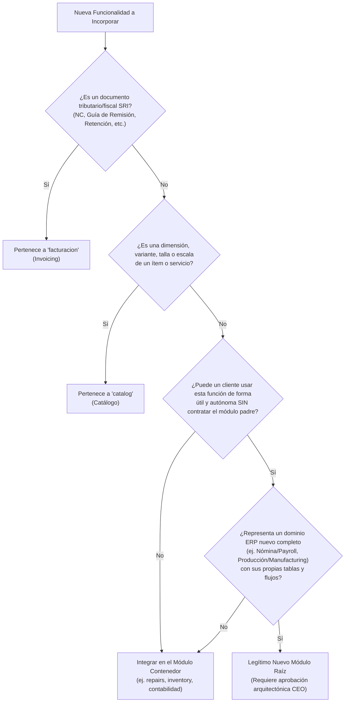

# Taxonomía Canónica de Módulos y Razonamiento Arquitectónico EcuNexo

Este skill establece el marco formal de razonamiento para determinar con precisión si una nueva funcionalidad pertenece a un **Módulo Raíz Existente** o si califica legítimamente como un **Nuevo Módulo Autónomo**, garantizando la coherencia en permisos RBAC, dependencias y límites de licenciamiento.

---

## 1. Los 12 Módulos Raíz Canónicos (Taxonomía Sagrada)

En la arquitectura EcuNexo existen **únicamente 12 módulos raíz**. Toda funcionalidad del ERP/SaaS debe ubicarse dentro de uno de ellos:

| Código Técnico (`TenantModuleCodes`) | Nombre Comercial | Dominio Funcional y Entidades Incluidas |
|---|---|---|
| `identity` | Identidad y Acceso | Usuarios, roles, permisos RBAC, tokens JWT, membresías de empresa y auditoría. Siempre activo por defecto. |
| `catalog` | Catálogo de Productos y Servicios | Ítems, servicios, combos, **producto matriz, escalas de tallas, colores, variantes multidimensionales (SKU hijo)**, marcas, categorías y listas de precios base. |
| `warehousing` | Bodegas y Ubicaciones | Almacenes físicos, bodegas lógicas, sucursales, perchas/ubicaciones y transferencias de bodega a bodega. |
| `inventory` | Control de Existencias | Kárdex (físico y valorado), movimientos de stock, ajustes de inventario, tomas físicas y valorización de inventario. |
| `facturacion` (`Invoicing`) | Facturación Electrónica SRI | Comprobantes electrónicos SRI: **Facturas (01)**, **Liquidaciones de Compra (03)**, **Notas de Crédito (04)**, **Notas de Débito (05)**, **Guías de Remisión (06)**, transportistas, puntos de emisión, secuenciales monotónicos SRI y contingencia offline. |
| `purchases` | Compras y Proveedores | Proveedores, recepción y auditoría de comprobantes XML del SRI, retenciones en compras, órdenes de compra y categorización ATS. |
| `contabilidad` (`Accounting`) | Contabilidad NIIF & Balances SCVS | Plan contable oficial SCVS, libro diario, partidas dobles, asientos automáticos, pre-declaración F104/F103 SRI y balances consolidados (P&G, Balance General). |
| `customers` | Clientes y Directorio Comercial | Directorio comercial B2B/B2C, cupos de crédito, condiciones de pago y cartera por cobrar. |
| `ecommerce` | E-commerce y Pedidos Web | Catálogo web sincronizado, órdenes online, checkout, pasarelas de pago y carritos abandonados. |
| `repairs` | Taller y Reparaciones B2B | Actas de recepción/entrega, lotes de equipos en reacondicionamiento técnico, diagnósticos y hojas de servicio. |
| `training` | Capacitación | Sesiones de inducción, formación operativa y talleres para el cliente. |
| `support` | Soporte Técnico SLA | Horas de asistencia técnica, atención de incidencias y soporte prioritario. |

---

## 2. Árbol de Decisión: ¿Módulo Nuevo o Capacidad Subordinada?

Antes de proponer o registrar un identificador en el sistema, evalúa obligatoriamente estas tres preguntas:



### Reglas Clave:
1. **Nunca crear módulos satélite** como `catalog.matrix`, `credit_notes` o `billing.remision_guides`. Son **capacidades y tipos de documento** de sus respectivos módulos padre (`catalog` y `facturacion`).
2. En la UI de emisión de licencias (`TENANT_MODULE_OPTIONS`), el operador solo elige entre los módulos raíz canónicos. Un cliente no compra "notas de crédito"; compra el módulo de **Facturación Electrónica SRI** que le permite emitir facturas, notas de crédito y guías de remisión.
3. Lo que diferencia el alcance comercial de un módulo son sus **Tiers y Límites** (`Small`, `Medium`, `Big`, `Enterprise`), no la fragmentación artificial en submódulos.

---

## 3. Convención Estricta para Permisos RBAC

La jerarquía de permisos del sistema debe obedecer estrictamente el estándar de tres niveles:

$$\text{permiso} = \langle\text{modulo\_raiz}\rangle.\langle\text{recurso}\rangle.\langle\text{accion}\rangle$$

### Reglas:
1. El primer segmento **SIEMPRE coincide con el código canónico del módulo raíz** (`identity`, `catalog`, `facturacion`, `inventory`, etc.).
2. El segundo segmento define el **recurso interno** (ej. `matrix`, `scale`, `notas.credito`, `guias.remision`).
3. El tercer segmento define la **operación** (`read`, `create`, `update`, `delete`, `anular`, `autorizar`).

### Ejemplos Válidos vs Inválidos:

| Caso | Permiso Canónico Válido | Forma Inválida Prohibida | Razón de Invalidez |
|---|---|---|---|
| **Matriz de Tallas** | `catalog.matrix.read`<br>`catalog.matrix.create`<br>`catalog.scale.manage` | `catalog.matrix.item.read`<br>`matrix.read` | Creaba un módulo falso `matrix` o una estructura con 4 niveles que rompe el RBAC mapper. |
| **Notas de Crédito** | `facturacion.notas.credito.read`<br>`facturacion.notas.credito.create`<br>`facturacion.notas.credito.anular` | `credit_notes.read`<br>`invoicing.credit_notes.read` | Trataba a la nota de crédito como módulo independiente o usaba código no canónico. |
| **Guías de Remisión** | `facturacion.guias.remision.read`<br>`facturacion.guias.remision.create`<br>`facturacion.guias.remision.autorizar` | `billing.remision_guides.create`<br>`guias.create` | El módulo oficial es `facturacion`. |
| **Lotes de Taller** | `repairs.batches.read`<br>`repairs.batches.create` | `batches.read` | Debe prefijarse con `repairs`. |

---

## 4. Reglas para Límites y Entitlements (`ModuleTierCatalog`)

Cuando una nueva funcionalidad requiere control de consumo (cupos, límites de almacenamiento o límites mensuales):
1. **Se asocia al módulo contenedor**: La métrica se añade al diccionario de límites del módulo raíz en `ModuleTierCatalog.cs`.
2. **Definir límites escalonados por Tier**:
   - `Small`: Microempresa / profesional.
   - `Medium`: Comercio o local estándar.
   - `Big`: Empresa PyME con volumen relevante.
   - `Enterprise`: Corporativo / ilimitado (`int.MaxValue`).

### Ejemplos en EcuNexo:
- En `Catalog`:
  - `LimitMaxActiveVariants`: Small = 100, Medium = 1.000, Big = 10.000, Enterprise = Ilimitado.
- En `Invoicing` (`facturacion`):
  - `LimitMaxMonthlyCreditNotes`: Small = 25, Medium = 100, Big = 500, Enterprise = Ilimitado.
  - `LimitMaxMonthlyRemisionGuides`: Small = 50, Medium = 250, Big = 1.000, Enterprise = Ilimitado.
  - `LimitMaxActiveCarriers`: Small = 5, Medium = 20, Big = 50, Enterprise = Ilimitado.

---

## 5. Plantilla para el Intercambio entre Cliente y Licencias

Cuando un agente en `Cliente` culmina una funcionalidad o extensión, debe entregar el prompt formateado según la taxonomía canónica:

```text
================================================================================
SOLICITUD DE REGISTRO / ACTUALIZACIÓN EN SUBSISTEMA DE LICENCIAS ECUNEXO
================================================================================

1. CLASIFICACIÓN TAXONÓMICA
--------------------------------------------------------------------------------
- Naturaleza: [Extensión de Módulo Existente | Nuevo Módulo Raíz]
- Módulo Raíz Canónico: [catalog | facturacion | inventory | warehousing | ...]
- Subcapacidad / Funcionalidad: [Nombre de la capacidad, ej. Matriz de Variantes / Notas de Crédito]

2. PERMISOS RBAC ASOCIADOS (Prefijo canónico obligatorio)
--------------------------------------------------------------------------------
- <modulo_raiz>.<recurso>.<accion>

3. LÍMITES Y TIERS DEL MÓDULO RAÍZ
--------------------------------------------------------------------------------
- Métrica: [nombre_de_limite]
- Small: [valor]
- Medium: [valor]
- Big: [valor]
- Enterprise: [valor / ilimitado]
================================================================================
```
